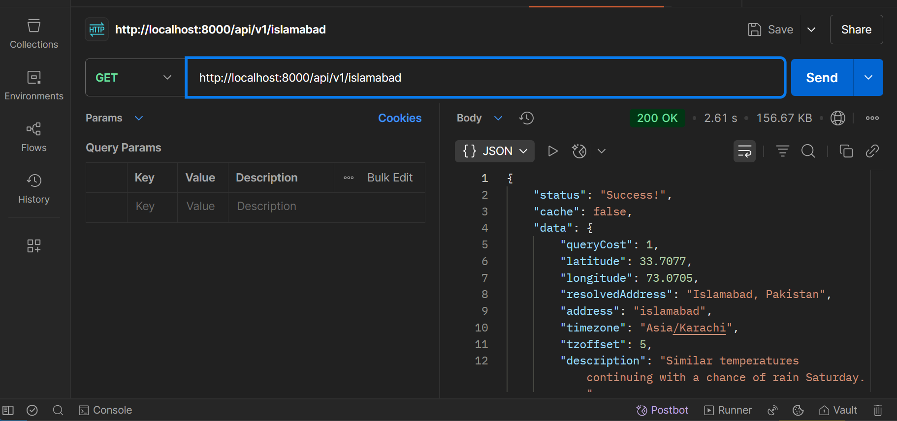
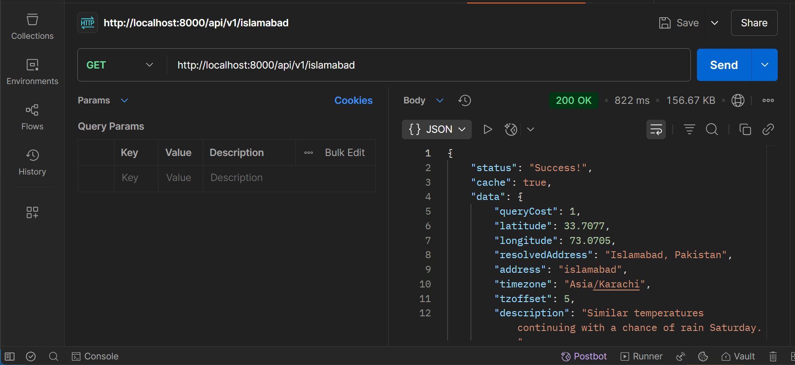

# 🌤️ Caching Weather API with Redis

This project demonstrates how to implement caching in a Node.js and Express application using **Redis**. The API fetches weather data from a third-party source and caches the results to reduce redundant API calls and improve performance.

## 🚀 Features

- Node.js + Express server
- Weather data retrieval via external API
- Redis for caching API responses
- Efficient logic: serve from cache when available, otherwise fetch and cache

## 🧠 What I Learned

- How to integrate Redis with a Node.js application
- How to improve performance using caching strategies
- How to structure a basic REST API

## 🛠️ Technologies Used

- Node.js
- Express
- Redis
- Fetch (or your HTTP client of choice)
- dotenv

## 🖼️ Screenshots

- Before caching the response took 2.61 seconds.
  
- After caching the response took 822 milliseconds.
  

## 📦 Installation

1. Clone the repository:

   ```bash
   git clone https://github.com/Developer-Bilal/weather-api-redis.git
   cd weather-api-redis
   ```

## 📧 Contact

If you have any questions or suggestions, feel free to reach out:

- Email: developer.bilal.channa@gmail.com ✉️
- LinkedIn: [Profile](https://www.linkedin.com/in/Engineer-Bilal-Channa) 💼

<!-- # Caching Weather API

Learned about caching and how to cache data in Redis.

### Steps

1. Create basic express server
2. Get weather data from weather API
3. Create Redis Client and connect
4. Function logic => if data is in cache return (GET) it else cache (SET) the data and return it. -->
